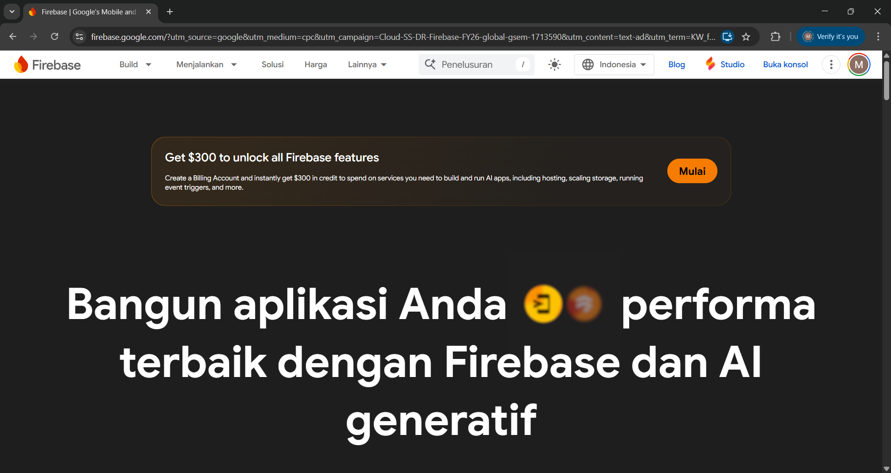
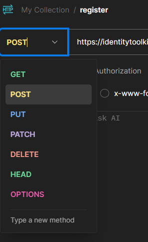
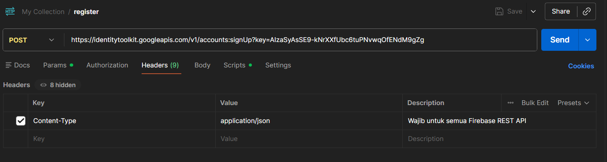
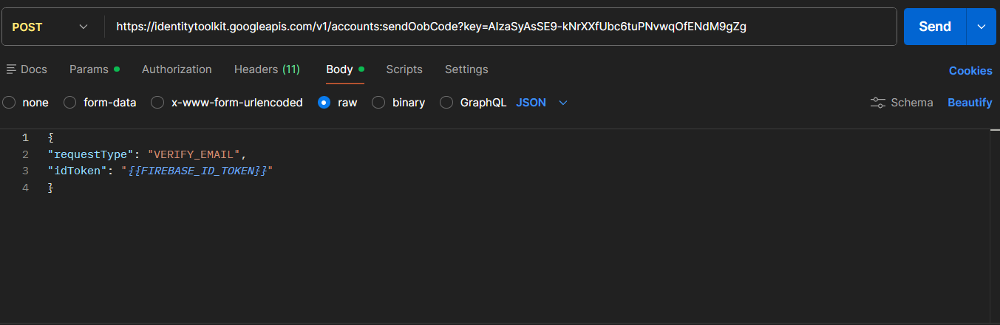

##  WEEK_3 Tugas api_postman

Mendokumentasi tentang cara menguji alur autentikasi (Authentication) dan verifikasi email menggunakan Firebase Identity Toolkit REST API dan sebuah Backend API, dengan alat bantu utama yaitu Postman

Step 1 : Register dan Verifikasi Email dengan Firebase Identity Toolkit REST API

Sebelum Memasuki Langkah langkah seperti register dan lain lain pada postman, Kita membuat Projectnya terlebih dahulu di Firebase:

1. Buka [Firebase Console](https://console.firebase.google.com/).
    
2. Buka console 
    
3. Klik "Add project" untuk membuat proyek baru.
    
4. project setting
    
5. Buat web app
    
6. Catat WEB API KEY karena akan di butuhkan pada langkah langkah di Postman
   
   Setelah Menyelesaikan pembuatan Project pada Firebase, Selanjutnya kita mulai langkah langkah yang dilakukan pada Postman: Langkah 1 (Register):

1. Buka tab baru di Postman.
2. Ubah metode HTTP menjadi POST.
   
3. Masukkan URL endpoint untuk registrasi pengguna Firebase Identity Toolkit REST API:https://identitytoolkit.googleapis.com/v1/accounts:signUp?key={{FIREBASE_API_KEY}}
4. Pindah ke tab Headers, tambahkan : key = Content-Type, Value = application/json
    
5. Pindah ke tab Body, pilih raw, lalu pastikan format di ujung kanan adalah JSON. Masukkan ini: { "email": "{{USER_EMAIL}}", "password": "{{USER_PASSWORD}}", "returnSecureToken": true }

6. Masuk ke bagian Scripts, pastikan pilih yang Post-reponse: const json = pm.response.json(); if (pm.response.code === 200) { pm.environment.set("FIREBASE_ID_TOKEN", json.idToken); pm.environment.set("FIREBASE_LOCAL_ID", json.localId); pm.environment.set("FIREBASE_REFRESH_TOKEN", json.refreshToken); console.log("Register sukses. UID:", json.localId); console.log("PERHATIAN: Email belum diverifikasi. Lanjut ke Step 2."); } else { console.log("Register gagal:", json.error.message); }

7. Klik "Send" untuk mengirim permintaan registrasi.

Step 2 (verifikasi Email):

1. Buka tab baru di Postman.
2. Ubah metode HTTP menjadi POST.
    
3. Masukkan URL berikut di kolom URL : https://identitytoolkit.googleapis.com/v1/accounts:sendOobCode?key={{FIREBASE_API_KEY}}
4. Pindah ke tab Headers, tambahkan : key = Content-Type, Value = application/json
   
5. Pindah ke tab Body, pilih raw, lalu pastikan format di ujung kanan adalah JSON. Masukkan ini: { "requestType": "VERIFY_EMAIL", "idToken": "{{FIREBASE_ID_TOKEN}}" }
   
6. Masuk ke bagian Scripts, pastikan pilih yang Post-reponse: if (pm.response.code === 200) { const json = pm.response.json(); console.log("Email verifikasi dikirim ke:", json.email); console.log("Sekarang buka inbox email dan klik link verifikasi."); console.log("Setelah klik, lanjut ke Step 3 untuk cek status."); } else { console.log("Gagal kirim email:", pm.response.json().error.message); }
    
7. Klik "Send" untuk mengirim permintaan verifikasi email.

8. Firebase menerima request ini dan membuat "action link" unik.

9. Firebase mengirim email ke user berisi link: ...?

10. User membuka email dan klik link tersebut.

11. Status emailVerified user di Firebase berubah menjadi true.